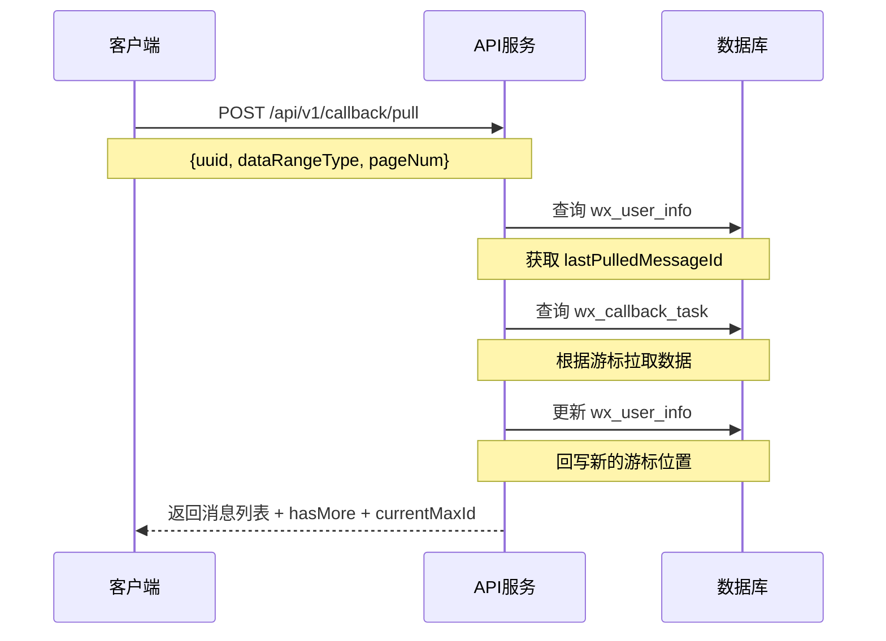

# 回调消息回拉 API 接入指南

## 一、接口定义

### 1.1 基本信息

- **接口路径**: `POST /api/v1/callback/pull`
- **Content-Type**: `application/json`
- **接口说明**: 根据设备 uuid 回拉消息记录，支持全量拉取和增量拉取两种模式

### 1.2 请求参数

```json
{
  "uuid": "string, 必填, 设备唯一标识",
  "dataRangeType": "integer, 必填, 数据范围类型: 0-全量拉取, 1-增量拉取",
  "pageNum": "integer, 可选, 每页数量, 默认10"
}
```

| 参数名 | 类型 | 必填 | 说明 | 示例值 |
|--------|------|------|------|--------|
| uuid | String | 是 | 设备唯一标识（运行实例ID） | "device-uuid-001" |
| dataRangeType | Integer | 是 | 数据范围类型<br>0: 全量拉取（从历史最小ID开始）<br>1: 增量拉取（从上次位置继续） | 1 |
| pageNum | Integer | 否 | 每页数量，默认 10 | 10 |

### 1.3 响应参数

```json
{
  "code": 0,
  "msg": "ok",
  "data": {
    "jsonContentList": ["string"],
    "hasMore": true,
    "currentMaxId": 30217
  }
}
```

| 字段名 | 类型 | 说明 |
|--------|------|------|
| code | Integer | 响应码，0 表示成功，非 0 表示失败 |
| msg | String | 响应消息 |
| data | Object | 响应数据 |
| └─ jsonContentList | List\<String\> | 回调消息内容的 JSON 字符串列表 |
| └─ hasMore | Boolean | 是否还有更多数据，true 表示可以继续拉取 |
| └─ currentMaxId | Long | 本次拉取的最大消息 ID，用于下次增量拉取的游标 |

### 1.4 错误响应

```json
{
  "code": 500,
  "msg": "未找到设备uuid对应的用户信息",
  "data": null
}
```

---

## 二、接入步骤

### 2.1 前置准备

#### 1️⃣ 执行数据库变更

```sql
-- 在 wx_user_info 表新增游标字段
ALTER TABLE `wx_user_info` 
ADD COLUMN `last_pulled_message_id` bigint DEFAULT NULL 
COMMENT '上次拉取的最大消息ID' AFTER `is_del`;
```

#### 2️⃣ 确认数据源

确保 `wx_callback_task` 表已有回调消息数据，且包含正确的 `uuid` 字段。

#### 3️⃣ 确保用户信息存在

调用拉取接口前，需要先确保 `wx_user_info` 表中存在对应 `uuid` 的用户记录。

---

### 2.2 接入流程



#### 步骤说明：

1. **发起请求**：客户端传入 `uuid`、`dataRangeType` 和 `pageNum`
2. **查询用户信息**：系统根据 `uuid` 查找用户记录及游标位置
3. **查询消息数据**：根据游标位置从 `wx_callback_task` 表拉取消息
4. **更新游标**：自动将本次拉取的最大 ID 回写到用户表
5. **返回结果**：返回消息列表、是否有更多数据、当前最大 ID

---

## 三、使用场景详解

### 3.1 场景一：首次全量拉取（重新拉取）

**适用场景**：
- 首次接入，需要拉取所有历史消息
- 数据丢失或异常，需要重新同步全部数据
- 切换设备或实例，需要重新初始化

**请求示例**：

```json
POST /api/v1/callback/pull
{
  "uuid": "device-uuid-001",
  "dataRangeType": 0,
  "pageNum": 10
}
```

**处理逻辑**：
- 从 `wx_callback_task` 表中该 `uuid` 对应的**最小 ID** 开始拉取
- 每次拉取 10 条（pageNum 可调整）
- 拉取完成后游标更新为本次的最大 ID
- `hasMore=true` 表示还有更多数据，继续调用可获取下一页

**完整拉取流程**：

```bash
# 第1次请求
{
  "uuid": "device-uuid-001",
  "dataRangeType": 0,
  "pageNum": 10
}
# 返回: { jsonContentList: [...], hasMore: true, currentMaxId: 100 }

# 第2次请求（继续全量拉取，使用增量模式提高效率）
{
  "uuid": "device-uuid-001",
  "dataRangeType": 1,
  "pageNum": 10
}
# 返回: { jsonContentList: [...], hasMore: true, currentMaxId: 200 }

# 第3次请求
# ... 重复直到 hasMore: false
```

---

### 3.2 场景二：增量拉取（日常使用）

**适用场景**：
- 日常运行，只需获取最新消息
- 定时轮询，保持数据同步
- 断线重连后，拉取遗漏的消息

**请求示例**：

```json
POST /api/v1/callback/pull
{
  "uuid": "device-uuid-001",
  "dataRangeType": 1,
  "pageNum": 10
}
```

**处理逻辑**：
- 读取 `wx_user_info.last_pulled_message_id` 作为起始位置
- 拉取 `id > lastPulledMessageId` 的新消息
- 自动更新游标为本次最大 ID
- 如果历史游标不存在（首次使用），则从最小 ID 开始拉取并记录日志

**定时轮询示例**：

```python
import requests
import time

def poll_messages():
    while True:
        response = requests.post(
            'http://your-server/api/v1/callback/pull',
            json={
                'uuid': 'device-uuid-001',
                'dataRangeType': 1,  # 增量拉取
                'pageNum': 10
            }
        )
        
        data = response.json()['data']
        
        if data['jsonContentList']:
            print(f"收到 {len(data['jsonContentList'])} 条消息")
            # 处理消息...
        
        if not data['hasMore']:
            print("没有更多数据，等待新消息...")
            time.sleep(60)  # 无新消息时等待60秒
        else:
            time.sleep(1)  # 有更多数据时快速拉取

poll_messages()
```

---

### 3.3 场景对比

| 对比项 | 全量拉取 (dataRangeType=0) | 增量拉取 (dataRangeType=1) |
|--------|---------------------------|---------------------------|
| **起始位置** | 历史最小 ID | 上次记录的游标位置 |
| **适用场景** | 首次接入、数据修复、重新同步 | 日常运行、定时轮询 |
| **游标依赖** | 不依赖，强制从头开始 | 依赖 `last_pulled_message_id` |
| **数据范围** | 可能包含已拉取的旧数据 | 只拉取未拉取的新数据 |
| **性能** | 首次较慢，后续可用增量模式 | 快速，只查新数据 |
| **推荐用法** | 首次使用1次，之后用增量 | 日常使用 |

---

## 四、最佳实践

### 4.1 推荐接入流程

```
1. 执行数据库变更脚本
   ↓
2. 首次全量拉取（dataRangeType=0）
   - 循环调用直到 hasMore=false
   - 处理并存储所有历史消息
   ↓
3. 切换到增量拉取（dataRangeType=1）
   - 定时轮询或事件触发
   - 只处理新增消息
```

### 4.2 代码示例

#### Java 示例

```java
public class CallbackPullClient {
    
    private String uuid = "device-uuid-001";
    private RestTemplate restTemplate = new RestTemplate();
    
    /**
     * 全量拉取所有历史消息
     */
    public void pullAllMessages() {
        int pageNum = 50;
        
        // 首次全量拉取
        CallbackPullResponse response = pullMessages(0, pageNum);
        processMessages(response);
        
        // 继续增量拉取剩余数据
        while (response.getHasMore()) {
            response = pullMessages(1, pageNum);
            processMessages(response);
        }
    }
    
    /**
     * 增量拉取新消息
     */
    public CallbackPullResponse pullNewMessages() {
        return pullMessages(1, 10);
    }
    
    private CallbackPullResponse pullMessages(int dataRangeType, int pageNum) {
        Map<String, Object> request = new HashMap<>();
        request.put("uuid", uuid);
        request.put("dataRangeType", dataRangeType);
        request.put("pageNum", pageNum);
        
        ResponseEntity<ApiResult<CallbackPullResponse>> response = 
            restTemplate.postForEntity(
                "http://your-server/api/v1/callback/pull",
                request,
                new ParameterizedTypeReference<ApiResult<CallbackPullResponse>>() {}
            );
        
        return response.getBody().getData();
    }
    
    private void processMessages(CallbackPullResponse response) {
        if (response.getJsonContentList() != null) {
            for (String jsonContent : response.getJsonContentList()) {
                // 解析并处理消息
                System.out.println("处理消息: " + jsonContent);
            }
        }
    }
}
```

#### cURL 示例

```bash
# 全量拉取
curl -X POST http://localhost:8080/api/v1/callback/pull \
  -H "Content-Type: application/json" \
  -d '{
    "uuid": "device-uuid-001",
    "dataRangeType": 0,
    "pageNum": 10
  }'

# 增量拉取
curl -X POST http://localhost:8080/api/v1/callback/pull \
  -H "Content-Type: application/json" \
  -d '{
    "uuid": "device-uuid-001",
    "dataRangeType": 1,
    "pageNum": 10
  }'
```

---

### 4.3 注意事项

1. **游标管理**
   - 游标由系统自动维护，无需手动设置
   - `dataRangeType=0` 会忽略游标，从头开始
   - `dataRangeType=1` 会使用并更新游标

2. **hasMore 判断**
   - `hasMore=true` 时立即继续拉取
   - `hasMore=false` 时可等待一段时间再拉取

3. **错误处理**
   - 如果返回 "未找到设备uuid对应的用户信息"，需先创建用户记录
   - 网络异常时重试不会导致游标错误（只有成功响应才会更新游标）

4. **性能优化**
   - 首次接入建议 `pageNum` 设置较大值（如 50-100）
   - 日常增量拉取可用较小值（如 10-20）
   - 根据实际消息量调整轮询间隔

5. **数据安全**
   - 消息按 ID 顺序返回，保证时序性
   - 重复拉取不会产生重复数据（严格大于游标值）

---

## 五、常见问题

### Q1: 如何判断是否需要重新拉取？

**A**: 检查返回的 `jsonContentList` 是否为空且 `hasMore=false`，这可能表示：
- 该 uuid 没有消息数据
- 用户信息不存在

### Q2: 增量拉取时历史消息会丢失吗？

**A**: 不会。如果历史游标不存在，系统会从最小 ID 开始拉取，确保不遗漏任何消息。

### Q3: 如何清理不需要的旧消息？

**A**: 使用 `dataRangeType=0` 重新拉取，并在客户端过滤不需要的消息。服务端只负责按顺序返回数据。

### Q4: 多个实例能否共用同一个 uuid？

**A**: 不建议。每个实例应使用独立的 uuid，否则会导致游标冲突和数据混乱。

---

## 六、技术支持

如有问题，请联系技术支持团队或查阅相关文档。
